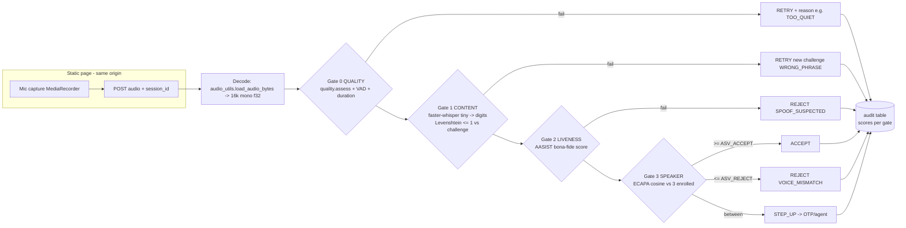

# MASTER PLAN — Dhwani-Kavach v2: Voiceprint Verification (SASV)

**The pivot:** stop asking *"is this voice AI?"* (open-world, unwinnable in general).
Start asking *"is this voice THIS enrolled customer, said live, right now?"* (closed-world 1:1
verification — a solved-enough problem with published error rates below 1%).

This document is the single source of truth for the pivot. It is written so that any
executor — a junior dev or a small AI model — can build, test, and deploy the system
phase by phase without other context. **Read [§14 Agent execution rules](#14-agent-execution-rules) before executing any phase.**

---

## 0. TL;DR

| | |
|---|---|
| **Product** | Bank customer enrolls voice once (3 short clips) → later proves identity by reading 6 random digits. Four gates decide: audio quality → said the right digits → live human (not TTS/replay) → same voice as enrolled. |
| **Verdicts** | `ACCEPT` / `RETRY` / `REJECT` / `STEP_UP` (borderline → fall back to OTP/agent) |
| **Models (all free, pretrained, CPU)** | ECAPA-TDNN (SpeechBrain, Apache-2.0) for voiceprints · AASIST / our fine-tuned w2v2 (already in `backend/models/`) for anti-spoof · faster-whisper *tiny* for the digit check · Silero VAD (already vendored) |
| **Nothing to train.** | Calibrate 3 thresholds on ~30 team recordings. That's it. |
| **Reused from current repo** | `ml/audio_utils.py` (decode anything → 16 kHz mono), `ml/quality.py` (mic/noise gate + plain-language reasons), `ml/vad.py` (speech ratio), `models/AASIST.pth` + `ml/aasist_model.py` (anti-spoof), the sqlite+cosine pattern from `app/voiceprints.py` |
| **New code** | ~1,200 lines total: `backend/verify_app/` (FastAPI, 6 endpoints, sqlite) + one static HTML page |
| **Deploy (₹0, no card)** | Hugging Face Spaces free CPU (2 vCPU / 16 GB, Docker) — primary. Cloudflare Quick Tunnel from a laptop — demo-day fallback. |
| **Build time** | ~3–4 focused days across 10 phases, each with an acceptance check. |

---

## 1. The concept — and one honest correction

### What we build

1. **Enrollment**: customer reads 3 short sentences (~20 s of speech). Each clip passes the
   quality gate and the anti-spoof gate (so nobody can enroll a cloned voice). We extract a
   192-dimensional **speaker embedding** ("voiceprint") per clip and store only those vectors —
   never the raw audio.
2. **Verification**: customer claims an identity (account no. / user id) → server issues a
   **random 6-digit challenge** valid for 90 seconds, one-time use → customer reads it aloud →
   the clip runs a 4-gate cascade → verdict with per-gate scores.

### Why this is strictly stronger than the old product

The old task ("detect AI voice, any voice, any speaker") is open-world: every new TTS engine
moves the target. The new task is closed-world: *does this clip match one known reference,
with liveness checks?* We get **identity** (is it really Mrs. Sharma?) for free on top of
**liveness** (is it a live human?). The burden of proof collapses from "model every fake in
the world" to "match one enrolled voice + reject non-live audio".

### ⚠️ The honest correction (judges WILL ask this)

**No voiceprint is inherently un-cloneable.** A speaker embedding measures vocal
characteristics; a good voice clone *imitates exactly those characteristics* — that is what
cloning means. Research is unambiguous: pure speaker-verification systems are fooled by
modern TTS/VC clones (this is why the ASVspoof and SASV research challenges exist).
**Un-spoofability is a property of the layered system, not of the fingerprint:**

| Layer | Kills |
|---|---|
| Random one-time digit challenge (90 s expiry) | All replays; all *pre-generated* clones. Attacker is forced into **real-time** cloning. |
| Anti-spoof gate (AASIST / our fine-tuned w2v2) | TTS/VC artifacts — and real-time cloning under time pressure produces *more* artifacts, not fewer. |
| Speaker gate (ECAPA cosine vs. enrollment) | Human impostors and mimics — modern embeddings are barely moved by human impersonation. |
| Anti-spoof **at enrollment** | Poisoned templates (enrolling a deepfake so it "matches" later). |

This layered design is exactly the **SASV (Spoofing-Aware Speaker Verification)**
architecture from the research community (SASV Challenge 2022 → 2025 literature):
ECAPA-TDNN as the speaker branch + AASIST-family as the countermeasure branch remains the
canonical open-source pairing in 2025 papers. We use the *cascade (AND-gate)* form rather
than learned score fusion: equally strong as a baseline, fully explainable to a bank, and
each gate produces a human-readable failure reason.

### Pitch line

> "Others answer *'is this voice AI?'* We answer *'is this voice **you**, live, right now?'* —
> and we can show which of the four locks stopped each attack."

---

## 2. Research grounding (what the executor may cite)

- **ECAPA-TDNN** (Desplanques et al., Interspeech 2020) — speaker embeddings, ~0.8 % EER on
  VoxCeleb1-O. Pretrained: `speechbrain/spkrec-ecapa-voxceleb` (Apache-2.0, ~20 M params, CPU-fast).
- **ASVspoof 2019/2021/5** — the spoof-countermeasure benchmark line; proves ASV alone falls
  to clones and CMs restore it.
- **AASIST** (Jung et al., ICASSP 2022) — graph-attention anti-spoof net, ~300 K params, CPU-fast.
  Weights already at `backend/models/AASIST.pth` with loader `backend/ml/aasist_model.py`.
- **SASV Challenge 2022** (arXiv:2203.14732) and 2025 SASV literature — ECAPA + AASIST cascade/fusion
  is the standard recipe; fusion helps on benchmarks, cascade stays the explainable strong baseline.
- **Text-prompted verification** (RSR2015 / RedDots lineage) — random-phrase challenge as
  replay defense is 10+ years of prior art.
- **Whisper** (Radford et al., 2022) — `tiny` via faster-whisper int8 is enough for digit ASR on CPU.
- **Over-the-air replay degradation** — SSL detectors degrade badly on re-recorded audio
  (already documented in our own `ml/quality.py` docstring) — this is why the quality gate
  aborts instead of guessing.

---

## 3. Patent landscape → component map

*Not legal advice. Takeaway: the patents the team found describe exactly the industry-standard
architecture — which validates the design. We implement with open-source components on
decades-old prior art (text-dependent speaker verification dates to the 1980s). Freedom-to-operate
is a question for a bank's counsel at commercialization, not for a hackathon prototype.*

| Patent(s) | What it teaches | Where it lives in our plan |
|---|---|---|
| EP3937474B1 — computer-generated speech detection for IVR | Run a synthetic-speech classifier on call audio, act on the result | **Gate 2 (anti-spoof)** — `ml/aasist_model.py` |
| EP4170527A1, GB2612397A, GB202400894D0 (family) — ASR + voice biometric auth | Check *what* was said (ASR) AND *who* said it (voice biometric) on the same audio | **Gate 1 + Gate 3 combined** — our challenge + ECAPA design |
| GB202219117D0, GB2528040A — compare sample to stored biometric; may request another sample | Enrollment template matching; step-up / retry on uncertainty | **Enrollment store + the `RETRY`/`STEP_UP` borderline band** |
| US20180004925A1 — voice template comparison → auth parameter | Similarity score against stored template, thresholded | **Gate 3 cosine score + `ASV_ACCEPT`/`ASV_REJECT` thresholds** |
| GB202102251D0, US20220262370A1 (family) — structured data from speech + authorized-user check | Extract structured content from speech; verify speaker is authorized | **Digit extraction from transcript + 1:1 verification** |
| US20260044587A1 — voice auth gates OTP release | Voice verification as a factor *before* issuing OTP/access | **Bank integration story: `ACCEPT` unlocks, `STEP_UP` falls back to OTP+agent** |

---

## 4. System architecture



**Verification is always 1:1** (user claims an id first), never 1:N search. This is how banks
do it, it is massively easier, and it means: **no vector database, no FAISS, ever** — a probe
is compared against ≤ 3 stored vectors. `app/voiceprints.py` already proved sqlite + linear
cosine is fine.

### Decision policy (exact)

Order matters — cheapest and most user-fixable first. First failing gate short-circuits.

| # | Gate | Pass condition (initial values — all in `config.py`, calibrated in Phase 7) | On fail |
|---|---|---|---|
| 0 | Quality | `quality.assess().ok` AND 2.0 s ≤ duration ≤ 20 s AND speech ≥ 1.5 s (VAD) | `RETRY` + specific reason (`TOO_QUIET`, `CLIPPING`, `NOISY`, `NO_SPEECH`, `TOO_SHORT`) |
| 1 | Content | Levenshtein(challenge digits, spoken digits) ≤ `CONTENT_MAX_EDITS=1` | `RETRY` with a **new** challenge, `WRONG_PHRASE`; after `MAX_ATTEMPTS=3` → `REJECT` |
| 2 | Liveness (**soft, calibrated** — see below) | bona-fide prob ≥ `CM_BONAFIDE_OK=0.35` → pass | bona-fide < `CM_BONAFIDE_REJECT=0.03` → hard `REJECT SPOOF_SUSPECTED`; **between** → `STEP_UP` contribution, never a silent reject |
| 3 | Speaker | score = mean of top-2 cosines vs 3 enrolled embeddings; ≥ `ASV_ACCEPT=0.40` | score ≤ `ASV_REJECT=0.25` → `REJECT` `VOICE_MISMATCH`; between → one `RETRY`, still between → `STEP_UP` |

> **⚠️ Gate 2 is a soft gate, and this is deliberate — read this before touching it.**
> Measured on this repo's own eval corpus (`backend/eval/results_calibrated.json`), the
> champion CM catches synthetic near-perfectly (VITS fakes all score spoof-prob > 0.93) but
> **false-flags ~7 of 15 genuine clean clips as fake** (genuine spoof-prob up to 0.95). This
> ASVspoof-generalization bias is intrinsic to every CM in `backend/models/` (cotrain, raw
> AASIST, SLS) — it is NOT fixed by swapping checkpoints; it needs augmentation retraining
> (a multi-day job, out of hackathon scope). A **hard** Gate 2 at 0.50 would therefore reject
> half of genuine customers. So Gate 2 never hard-rejects except at near-certainty
> (`CM_BONAFIDE_REJECT`, calibrated so ZERO genuine team clip lands there); the borderline
> escalates to `STEP_UP`. Security for the "played a fake" case is carried primarily by the
> random one-time challenge (Gate 1, kills replays + pre-generated clones) and the independent
> speaker gate (Gate 3). Gate 2's honest job here: catch the *near-certain* real-time synthetic
> and push anything ambiguous to human step-up. **Phase 7 sets all three CM thresholds from the
> team's own live-mic digit recordings (the real target distribution) and A/B-picks
> `KV_CM=cotrain|sls` at a fixed clone-catch rate.** Do not raise `CM_BONAFIDE_REJECT` off a
> desk guess — measure it.

Expected cosine distributions with ECAPA, same device: genuine ≈ 0.55–0.75, impostor < 0.20.
If Phase 7 measurements disagree wildly, something is wired wrong (e.g. embedding not
L2-normalized) — investigate before touching thresholds.

**Enrollment policy**: 3 clips; each must pass Gate 0 AND Gate 2 (anti-spoof at enrollment —
blocks template poisoning). Pairwise cosine between the 3 clips must be ≥
`ENROLL_CONSISTENCY_MIN=0.45` — otherwise the odd clip out is re-recorded (catches a friend
recording clip 2, TV in background, etc.).

### Latency budget (2 vCPU free tier, per verification)

decode 0.2–0.5 s · VAD+quality < 0.1 s · whisper tiny int8 1–2 s · AASIST 0.3–1 s ·
ECAPA 0.3–0.8 s → **2–5 s total**. The UI shows staged progress ("checking quality → phrase →
liveness → voice match"), which doubles as demo theater.

---

## 5. Data model & API contract

### sqlite schema (`backend/verify_app/store.py`, WAL mode, path from env `KAVACH_DB`, default `verify_app/kavach.db`)

```sql
CREATE TABLE IF NOT EXISTS users(
  user_id TEXT PRIMARY KEY, display_name TEXT,
  enrolled INTEGER DEFAULT 0, created_at TEXT);
CREATE TABLE IF NOT EXISTS embeddings(
  user_id TEXT, slot INTEGER, vec BLOB,           -- 192 float32 = 768 bytes
  quality_json TEXT, created_at TEXT,
  PRIMARY KEY(user_id, slot));
CREATE TABLE IF NOT EXISTS sessions(
  session_id TEXT PRIMARY KEY, user_id TEXT, mode TEXT,  -- 'enroll'|'verify'
  challenge TEXT, expires_at REAL, attempts INTEGER DEFAULT 0,
  done INTEGER DEFAULT 0);
CREATE TABLE IF NOT EXISTS audit(
  id INTEGER PRIMARY KEY AUTOINCREMENT, ts TEXT, user_id TEXT, session_id TEXT,
  mode TEXT, verdict TEXT, gate_failed TEXT, scores_json TEXT, label TEXT); -- label: set by test harness ('genuine'/'impostor'/'attack'), NULL in prod
CREATE TABLE IF NOT EXISTS lockouts(
  user_id TEXT PRIMARY KEY, fails INTEGER, until REAL);
```

Raw audio is **never persisted** unless env `KEEP_AUDIO=1` (debug only). Embeddings are not
invertible to speech, but they are linkable — production note in §12.

### Endpoints (all under `/v2`, router in `backend/verify_app/api.py`)

| Endpoint | Body | Returns |
|---|---|---|
| `GET /v2/health` | — | `{status:"ok", models_loaded:true}` — frontend polls this before enabling the mic button (cold-start UX) |
| `POST /v2/session` | `{user_id, mode:"enroll"\|"verify", display_name?}` | `{session_id, mode, expires_at, challenge?}` — verify mode: `challenge:"472903"`; enroll mode: `prompts:[3 sentences]`. Errors: `NOT_ENROLLED` (verify for unknown user), `ALREADY_ENROLLED`, `LOCKED` |
| `POST /v2/audio` | multipart: `session_id`, `slot` (enroll 0-2), `file` | The full verdict object (below) |
| `GET /v2/admin/users` · `DELETE /v2/admin/users/{id}` · `GET /v2/admin/audit` | header `X-Admin-Key` | list / GDPR-delete / audit dump |

### Verdict object (single shape for both modes — the frontend renders gates from it)

```json
{
  "verdict": "ACCEPT | RETRY | REJECT | STEP_UP | LOCKED | ENROLL_SLOT_OK | ENROLLED",
  "gate_failed": "quality | content | liveness | speaker | null",
  "reasons": ["WRONG_PHRASE"],
  "scores": {
    "quality": {"ok": true, "snr_db": 21.3, "rms": 0.041, "clip_frac": 0.0, "speech_sec": 4.2},
    "content": {"expected": "472903", "heard": "472903", "edits": 0, "ok": true},
    "liveness": {"bonafide_p": 0.93, "ok": true},
    "speaker":  {"cosine": 0.61, "ok": true}
  },
  "attempts_left": 2,
  "new_challenge": "830174"
}
```

Reason-code enum (complete): `NO_AUDIO TOO_SHORT TOO_LONG TOO_QUIET CLIPPING NOISY NO_SPEECH
WRONG_PHRASE SPOOF_SUSPECTED VOICE_MISMATCH BORDERLINE_VOICE SESSION_EXPIRED SESSION_USED
TOO_MANY_ATTEMPTS NOT_ENROLLED ALREADY_ENROLLED ENROLL_INCONSISTENT LOCKED BAD_AUDIO_FORMAT`.

Every reason code has fixed user-facing copy in the frontend (§6 table) — the server sends
codes, never prose, so copy can change without a redeploy.

---

## 6. Edge-case & failure matrix (build ALL of this — it is the product)

### 6.1 Microphone / capture failures (client-side, before any upload)

| Condition | How detected | User-facing copy | Dev handling |
|---|---|---|---|
| Permission denied | `getUserMedia` throws `NotAllowedError` | "Microphone access is blocked. Click the lock icon in the address bar → Site settings → Allow microphone, then reload." | Show persistent banner + "reload" button. Never auto-reprompt in a loop. |
| No mic at all | `NotFoundError` | "No microphone found. Plug one in or check your system sound settings, then press Retry." | Retry button re-runs `getUserMedia`. |
| **Mic busy or faulty** | `NotReadableError` | "Your microphone is in use or not responding. Close apps that use the mic (Zoom, Meet, Teams) or pick another microphone, then Retry." | This is the literal "mic is broken" case. Offer device picker via `enumerateDevices()`. |
| Overconstrained | `OverconstrainedError` | (none) | Silently retry with plain `{audio:true}`. |
| Insecure context | `location.protocol !== 'https:'` and not localhost | "This page needs a secure (https) link — open the https URL." | HF Spaces / cloudflared are always https; this only trips on raw LAN IPs. |
| **Mic connected but silent** (hardware mute switch, OS-muted, gain 0) | Live RMS watchdog: while recording, if 1.5 s of samples stay < 0.001 RMS → warn | Inline banner: "We can't hear you — is your microphone muted?" | AnalyserNode loop already drives the level meter; the watchdog is 5 extra lines. Also listen to `track.onmute`. |
| Device unplugged mid-recording | `track.onended` | "Microphone disconnected — please retry." | Abort recording, discard buffer. |
| Browser has no MediaRecorder mimeType we expect | `MediaRecorder.isTypeSupported` probe chain | — | Fallback order: `audio/webm;codecs=opus` → `audio/webm` → `audio/mp4` (Safari) → `audio/ogg`. Server decodes all via `audio_utils.load_audio_bytes` (3-tier: soundfile → librosa → bundled ffmpeg). |
| Double-click / double-submit | disable button during in-flight request | — | Also server-side: session `attempts` counter is the source of truth. |
| Upload dies (bad hotel Wi-Fi) | fetch throws / times out (30 s AbortController) | "Upload failed — check your connection and retry. Your recording was not counted." | Failed *upload* must NOT consume an attempt (server only counts processed audio). |

### 6.2 Server-side quality rejections (Gate 0 — reuses `ml/quality.py` reasons)

| Reason | Copy |
|---|---|
| `TOO_QUIET` | "You're too quiet — move the mic closer and speak up a bit." |
| `CLIPPING` | "The mic is overloading — move it a little further from your mouth." |
| `NOISY` | "Too much background noise — move somewhere quieter and retry." |
| `NO_SPEECH` / `TOO_SHORT` | "We didn't catch enough speech — press record, then read the whole code." |
| `TOO_LONG` | "That was too long — just read the 6 digits and stop." |

### 6.3 Human & lifecycle edge cases

| Case | Handling |
|---|---|
| User has a cold / voice changed | Cosine lands in the borderline band → one retry → `STEP_UP` (in a real bank: OTP + agent). Never hard-reject a mildly-off genuine user. |
| Identical twins / very similar voices | Known biometric limitation. Mitigation: challenge + liveness still hold; bank policy can require step-up for flagged accounts. Say this honestly in the demo. |
| User enrolls on laptop, verifies on phone | Channel mismatch lowers genuine scores. Enrollment screen says: "Use the device you'll normally verify with, in a quiet room." Threshold band absorbs the rest. |
| User reads digits in Hindi/other language | v1 challenge UI shows numerals ("4 7 2 9 0 3") and asks for English. Whisper tiny is multilingual — a Hindi digit map is a 10-line addition, listed as stretch. |
| Homophones (for/four, to/two, ate/eight, oh/zero) | Normalization map in `challenge.py` accepts them all. |
| Whisper mishears one digit of a genuine user | `CONTENT_MAX_EDITS=1` tolerates a single edit; 6-digit space keeps guessing infeasible (≤ 13 of 10⁶ sequences within distance 1). |
| TV / second speaker in background | Usually fails Gate 0 (SNR) or Gate 3 (mixed embedding). Copy asks for a quieter spot. Full diarization is out of scope — noted limitation. |
| User walks away mid-session | Session expires at 90 s → `SESSION_EXPIRED`, new session restarts cleanly. |
| Brute-force retries | `MAX_ATTEMPTS=3` per session; 5 consecutive failed verify *sessions* per user in 15 min → `lockouts` row → `LOCKED` verdict (copy: "Too many attempts — try again in 15 minutes or contact the bank."). |
| Attacker posts audio straight to the API (no browser) | Fine — the API is the security boundary, not the page: challenge is random, single-use, 90 s expiry, attempts counted. Replaying an old accepted file fails Gate 1 (different digits). |
| Attacker enrolls a clone of a victim | Gate 2 runs on **enrollment clips too**. Also production note: enrollment happens in-branch / inside authenticated app session — hackathon assumes the enrolling user is legitimate apart from spoof-check. |
| Server cold start (free tier sleeps) | `/v2/health` returns `models_loaded:false` until warm; frontend shows "Waking up the engine…" and polls every 3 s. Demo runbook: open the Space 15 min early. |
| sqlite wiped (free tier disk is ephemeral) | Acceptable: the demo *enrolls live on stage* (better theater). Optional: admin export/import endpoint for a db snapshot (30 lines, stretch). |
| Two requests race on one session | sqlite WAL + `attempts` increment inside one transaction; second request sees `done=1` → `SESSION_USED`. |
| Giant / garbage upload | Reject > 8 MB before decode; decode failure → `BAD_AUDIO_FORMAT`; ffmpeg subprocess timeout 10 s. |

---

## 7. Threat model (demo-ready table)

| Attack | Stopped by | Residual risk (be honest) |
|---|---|---|
| Random impostor calls in | Gate 3 (cosine < 0.25 typical) | ~zero |
| Skilled human mimic | Gate 3 — embeddings track physiology, not impressions | very low |
| Replay of victim's real recording | Gate 1 — digits won't match a 90 s one-time challenge | ~zero |
| Pre-generated deepfake clone | Gate 1 (wrong digits) | ~zero |
| **Real-time** deepfake clone reading the challenge | Gate 2 (artifacts worsen under real-time constraint) + Gate 0 (over-the-air replay degrades quality) | **The real fight.** Say: "no vendor honestly claims 100 % here; we detect + rate-limit + step-up. Layered security, not magic." |
| Template theft (steal the DB) | Embeddings ≠ audio; can't be replayed as sound through Gate 1 anyway | Linkability — production fix: encrypt at rest + cancellable templates (§12) |
| Enrollment poisoning | Gate 2 at enrollment + authenticated enrollment context | low |
| API brute force | One-time nonce, expiry, attempts cap, lockout | standard |
| DoS the free tier | Out of scope for hackathon; note rate-limit middleware exists as stretch | — |

---

## 8. Build plan — 10 phases

> Every phase ends with a runnable **Acceptance check**. Do not start phase *N+1* until the
> check for *N* passes. All tunables live in `verify_app/config.py` — no threshold literals
> anywhere else, ever.

### Phase 0 — Scaffold & environment (~1 h)

**Files**: `backend/verify_app/{__init__.py, config.py, main.py}`, `backend/requirements-verify.txt`

1. Create `backend/verify_app/` package. It must import from the existing `backend/ml/`
   package (`audio_utils`, `quality`, `vad`, `aasist_model`) — **read those files first**;
   do not rewrite them.
2. `requirements-verify.txt` — pin exactly (matches existing pins where shared):

   ```
   fastapi==0.111.0
   uvicorn[standard]==0.29.0
   torch==2.3.0
   torchaudio==2.3.0
   speechbrain==1.0.2
   faster-whisper==1.0.3
   librosa==0.10.2
   soundfile==0.12.1
   numpy==1.26.4
   onnxruntime==1.27.0
   imageio-ffmpeg==0.5.1
   python-multipart==0.0.9
   huggingface_hub==0.24.6
   ```

   Local (Windows): `python -m pip install -r backend/requirements-verify.txt` into the
   existing backend venv. If speechbrain's pull of torchaudio conflicts, install with
   `--no-deps` for speechbrain and add `hyperpyyaml sentencepiece` manually.
3. `config.py` — every knob with env override:

   ```python
   import os
   def _f(name, default): return float(os.environ.get(name, default))
   def _i(name, default): return int(os.environ.get(name, default))

   DUR_MIN_S        = _f("KV_DUR_MIN", 2.0)
   DUR_MAX_S        = _f("KV_DUR_MAX", 20.0)
   SPEECH_MIN_S     = _f("KV_SPEECH_MIN", 1.5)
   CONTENT_MAX_EDITS= _i("KV_CONTENT_EDITS", 1)
   CM_BONAFIDE_MIN  = _f("KV_CM_MIN", 0.50)
   ASV_ACCEPT       = _f("KV_ASV_ACCEPT", 0.40)
   ASV_REJECT       = _f("KV_ASV_REJECT", 0.25)
   ENROLL_CONSISTENCY_MIN = _f("KV_ENROLL_MIN", 0.45)
   MAX_ATTEMPTS     = _i("KV_MAX_ATTEMPTS", 3)
   SESSION_TTL_S    = _f("KV_SESSION_TTL", 90.0)
   LOCKOUT_FAILS    = _i("KV_LOCKOUT_FAILS", 5)
   LOCKOUT_MIN      = _f("KV_LOCKOUT_MIN", 15.0)
   MAX_UPLOAD_BYTES = _i("KV_MAX_UPLOAD", 8_000_000)
   ADMIN_KEY        = os.environ.get("KV_ADMIN_KEY", "dev-admin-key")
   DB_PATH          = os.environ.get("KAVACH_DB", os.path.join(os.path.dirname(__file__), "kavach.db"))
   KEEP_AUDIO       = os.environ.get("KEEP_AUDIO", "0") == "1"
   ENROLL_PROMPTS = [
       "My voice is my password and it keeps my account safe every single day.",
       "I bank securely from my phone whether I am at home or travelling far away.",
       "Seven three nine two five one eight zero four six.",
   ]
   ```

   (Prompt 3 is digits on purpose — enrollment then covers the same phonetic ground as
   verification challenges.)
4. `main.py` — FastAPI app, `lifespan` that calls `models.load_all()` (Phase 3/4/5 fill it),
   mounts the router and `static/`. Run with
   `uvicorn verify_app.main:app --host 0.0.0.0 --port 8000` from `backend/`.

**Acceptance**: `curl localhost:8000/v2/health` → `{"status":"ok","models_loaded":false}`.

### Phase 1 — Frontend capture page (~4 h)

**File**: `backend/verify_app/static/index.html` (single file: HTML+CSS+JS, no build step, no framework)

Layout: header → user-id input → two tabs (Enroll / Verify) → big record button + live level
meter → status area → **four gate cards** (Quality / Phrase / Liveness / Voice) that flip
grey→green/red from the verdict object → verdict banner.

The recorder core (write it exactly like this — the error map is the deliverable):

```html
<script>
const $ = id => document.getElementById(id);
let stream, rec, chunks = [], audioCtx, analyser, meterRAF;

const MIME = ["audio/webm;codecs=opus","audio/webm","audio/mp4","audio/ogg"]
  .find(m => window.MediaRecorder && MediaRecorder.isTypeSupported(m));

const MIC_ERRORS = {
  NotAllowedError: "Microphone access is blocked. Click the lock icon in the address bar → allow the microphone, then reload.",
  NotFoundError:   "No microphone found. Plug one in or check system sound settings, then press Retry.",
  NotReadableError:"Your microphone is in use or not responding. Close apps using the mic (Zoom, Meet, Teams) or choose another mic, then Retry.",
  SecurityError:   "This page needs a secure (https) link — open the https URL.",
};

async function getMic() {
  try {
    return await navigator.mediaDevices.getUserMedia({audio:
      {echoCancellation:true, noiseSuppression:true, autoGainControl:true}});
  } catch (e) {
    if (e.name === "OverconstrainedError")
      return navigator.mediaDevices.getUserMedia({audio:true});   // silent fallback
    showBanner(MIC_ERRORS[e.name] || ("Mic error: " + e.name), "error");
    throw e;
  }
}

function startMeter(stream) {                       // level meter + silent-mic watchdog
  audioCtx = new (window.AudioContext||window.webkitAudioContext)();
  analyser = audioCtx.createAnalyser(); analyser.fftSize = 2048;
  audioCtx.createMediaStreamSource(stream).connect(analyser);
  const buf = new Float32Array(analyser.fftSize);
  let silentSince = performance.now();
  (function tick(){
    analyser.getFloatTimeDomainData(buf);
    const rms = Math.sqrt(buf.reduce((s,v)=>s+v*v,0)/buf.length);
    $("meter").style.width = Math.min(100, rms*800) + "%";
    if (rms > 0.001) silentSince = performance.now();
    $("muted-warn").hidden = (performance.now() - silentSince) < 1500;
    meterRAF = requestAnimationFrame(tick);
  })();
}

async function record(maxMs = 9000) {               // resolves with a Blob
  stream = await getMic();
  stream.getTracks()[0].onended = () => showBanner("Microphone disconnected — please retry.", "error");
  startMeter(stream);
  return new Promise(res => {
    chunks = [];
    rec = new MediaRecorder(stream, MIME ? {mimeType: MIME} : undefined);
    rec.ondataavailable = e => chunks.push(e.data);
    rec.onstop = () => {
      cancelAnimationFrame(meterRAF); audioCtx.close();
      stream.getTracks().forEach(t => t.stop());
      res(new Blob(chunks, {type: rec.mimeType}));
    };
    rec.start();
    setTimeout(() => rec.state === "recording" && rec.stop(), maxMs);
    $("stopBtn").onclick = () => rec.state === "recording" && rec.stop();
  });
}

async function submit(sessionId, slot, blob) {
  const fd = new FormData();
  fd.append("session_id", sessionId); fd.append("slot", slot);
  fd.append("file", blob, "clip." + (blob.type.includes("mp4") ? "mp4" : "webm"));
  const ctl = new AbortController(); setTimeout(() => ctl.abort(), 30000);
  try {
    const r = await fetch("/v2/audio", {method:"POST", body:fd, signal:ctl.signal});
    return await r.json();
  } catch {
    showBanner("Upload failed — check your connection and retry. Your recording was not counted.", "error");
    return null;
  }
}
</script>
```

Also implement: health polling on load (disable record button until `models_loaded`,
"Waking up the engine…" text), the reason-code→copy map from §6.2, gate-card rendering from
`verdict.scores`, a 3-2-1 countdown before recording, auto-stop at 9 s.

**Acceptance**: page loads over `http://localhost:8000/`, denies-mic shows the right banner
(test via browser site-settings), record produces a Blob, level meter moves, hardware-muted
mic shows "can't hear you" within 2 s.

### Phase 2 — Ingest + Gate 0 (~2 h)

**File**: `backend/verify_app/pipeline.py` (started), `backend/verify_app/gates.py`

1. `pipeline.decode(upload_bytes) -> np.ndarray`: size check (`MAX_UPLOAD_BYTES`) →
   `ml.audio_utils.load_audio_bytes(data, 16000)` → on exception `BAD_AUDIO_FORMAT`.
2. `gates.quality_gate(wav) -> dict`: duration bounds → `ml.quality.assess(wav)` →
   speech seconds via `ml/vad.py` (**read that file first and call its actual API**; contract
   needed: seconds of speech in the clip). Map failures to reason codes from §5.
3. Trim leading/trailing non-speech using the VAD segments before returning the wav — both
   ECAPA and the CM behave better without 2 s of silence padding.

**Acceptance**: `python -m verify_app.selfcheck_quality` — feed it (a) 1 s of zeros →
`NO_SPEECH`, (b) white noise at full scale → `CLIPPING`/`NOISY`, (c) a real fixture recording
from `sample_audio/` → `ok:true`. Write this ~20-line selfcheck as part of the phase.

### Phase 3 — Speaker engine + store (~3 h)

**Files**: `backend/verify_app/speaker.py`, `backend/verify_app/store.py`

`speaker.py` (complete):

```python
"""ECAPA-TDNN speaker embeddings. speechbrain/spkrec-ecapa-voxceleb, Apache-2.0.
192-d L2-normalized vectors; cosine similarity = dot product."""
from __future__ import annotations
import os
import numpy as np
import torch

_MODEL = None

def load():
    global _MODEL
    if _MODEL is None:
        from speechbrain.inference.speaker import EncoderClassifier
        _MODEL = EncoderClassifier.from_hparams(
            source="speechbrain/spkrec-ecapa-voxceleb",
            savedir=os.environ.get("ECAPA_DIR",
                     os.path.join(os.path.dirname(__file__), ".cache", "ecapa")),
            run_opts={"device": "cpu"},
        )
    return _MODEL

def embed(wav16k: np.ndarray) -> np.ndarray:
    with torch.no_grad():
        t = torch.from_numpy(np.ascontiguousarray(wav16k)).float().unsqueeze(0)
        e = load().encode_batch(t).squeeze().cpu().numpy().astype(np.float32)
    return e / (np.linalg.norm(e) + 1e-9)

def score(enrolled: list[np.ndarray], probe: np.ndarray) -> float:
    """Mean of the top-2 cosines — robust to one weak enrollment clip."""
    sims = sorted((float(np.dot(e, probe)) for e in enrolled), reverse=True)
    return float(np.mean(sims[:2])) if len(sims) >= 2 else sims[0]
```

`store.py`: schema from §5, module-level connection with `threading.Lock` (copy the pattern
from `app/voiceprints.py` — it is already correct), functions:
`create_user, get_user, add_embedding(user_id, slot, vec, quality), get_embeddings(user_id)
-> list[np.ndarray], mark_enrolled, create_session, get_session, bump_attempt,
finish_session, log_audit, check_lockout, record_fail, clear_fails, delete_user, list_users,
dump_audit`. Vectors: `vec.tobytes()` in, `np.frombuffer(blob, dtype=np.float32)` out.

**Acceptance**: `python -m verify_app.selfcheck_speaker` — embeds two different clips of the
same speaker from `sample_audio/` (record two if absent) + one different speaker; asserts
same-speaker cosine > different-speaker cosine; asserts `store` round-trips a vector
byte-identically; asserts first `embed()` call after `load()` takes < 3 s on this machine.

### Phase 4 — Challenge + Gate 1 (~3 h)

**Files**: `backend/verify_app/challenge.py`, `backend/verify_app/asr.py`

`challenge.py` (complete):

```python
"""Random digit challenges + tolerant matching of what Whisper heard."""
import secrets

def new_challenge(n: int = 6) -> str:
    return "".join(secrets.choice("0123456789") for _ in range(n))

_W2D = {"zero":"0","oh":"0","o":"0","one":"1","won":"1","two":"2","to":"2","too":"2",
        "three":"3","tree":"3","four":"4","for":"4","fore":"4","five":"5","six":"6",
        "seven":"7","eight":"8","ate":"8","nine":"9"}

def digits_from(text: str) -> str:
    out = []
    for tok in "".join(c if c.isalnum() else " " for c in text.lower()).split():
        if tok.isdigit(): out.extend(tok)
        elif tok in _W2D: out.append(_W2D[tok])
    return "".join(out)

def edit_distance(a: str, b: str) -> int:
    prev = list(range(len(b) + 1))
    for i, ca in enumerate(a, 1):
        cur = [i]
        for j, cb in enumerate(b, 1):
            cur.append(min(prev[j] + 1, cur[-1] + 1, prev[j-1] + (ca != cb)))
        prev = cur
    return prev[-1]

def content_ok(expected: str, transcript: str, max_edits: int) -> dict:
    heard = digits_from(transcript)
    d = edit_distance(expected, heard)
    return {"expected": expected, "heard": heard, "edits": d, "ok": d <= max_edits}
```

`asr.py`: faster-whisper singleton —
`WhisperModel("tiny", device="cpu", compute_type="int8")`; transcribe with `beam_size=1,
language="en", condition_on_previous_text=False, temperature=0.0`; join segment texts.

**Acceptance**: `python -m verify_app.selfcheck_challenge` — asserts
`digits_from("four seven 2 nine oh three") == "472903"`, homophones map ("for to ate" →
"428"), `edit_distance` on 3 known pairs; then records-or-uses a fixture clip of someone
reading known digits and asserts `content_ok(...).ok`.

### Phase 5 — Gate 2 liveness adapter (~2 h)

**File**: `backend/verify_app/liveness.py`

Contract: `bonafide_p(wav16k: np.ndarray) -> float` in [0,1], higher = more likely live human.

1. **Read `backend/ml/aasist_model.py` and `backend/ml/detector*.py` first.** Wrap the
   existing AASIST load/infer path (weights: `backend/models/AASIST.pth`). Map its output to
   bona-fide probability (check sign/index convention in the existing code — do not guess).
2. Optional accuracy upgrade: the fine-tuned `w2v2aasist_cotrain.safetensors` behind the same
   function, env-selected (`KV_CM=aasist|w2v2`). Measure latency on target hardware
   (2 vCPU): if w2v2 > 4 s per clip, ship AASIST on the free tier. Our earlier finding
   applies: **truncate input** to the model's training length for the CPU win.
3. This gate runs on enrollment clips too (§4 enrollment policy).

**Acceptance**: `python -m verify_app.selfcheck_liveness` — real mic fixture scores
bona-fide > a TTS fixture (generate one TTS clip locally with any free TTS, e.g. `edge-tts`,
for test purposes — it's our own red-team fixture). Print both scores and the latency.

### Phase 6 — API + decision policy (~4 h)

**Files**: `backend/verify_app/api.py`, finish `pipeline.py`, wire `main.py`

`pipeline.verify(session, wav) -> verdict_dict` — the cascade, exactly the policy table in
§4, building the §5 verdict object, one gate at a time, short-circuiting. `pipeline.enroll_slot(session, slot, wav)`
runs Gate 0 + Gate 2 + embed + store; on slot 3 completion runs the pairwise consistency
check (fail → verdict `RETRY`, `reasons:["ENROLL_INCONSISTENT"]`, `redo_slot: <index of the
clip with lowest mean similarity>`) then marks enrolled.

Session rules enforced in `api.py` (all in one sqlite transaction per request): exists,
`mode` matches, not expired (`SESSION_EXPIRED`), not `done` (`SESSION_USED`), attempts <
`MAX_ATTEMPTS` (`TOO_MANY_ATTEMPTS`), user not locked (`LOCKED`). On verify fail at Gates
1–3: bump attempts; if `RETRY`, generate + return `new_challenge` (update the session row).
On final `REJECT`: `record_fail(user)` (lockout counter). On `ACCEPT`: `clear_fails`,
`finish_session`. Every request appends to `audit` (with `label` from an optional
`X-Test-Label` header — the calibration harness uses this, ignore in prod).

Admin endpoints check `X-Admin-Key == config.ADMIN_KEY` (403 otherwise).

**Acceptance**: `python scripts/smoke_verify.py` (write it): spins the API against fixtures —
(1) enroll 3 clips → `ENROLLED`; (2) genuine verify → `ACCEPT`; (3) resubmit the *same
accepted file* on a *new* session → `RETRY WRONG_PHRASE` (replay dead); (4) different-speaker
fixture → `REJECT VOICE_MISMATCH`; (5) expired session → `SESSION_EXPIRED`; (6) wrong admin
key → 403. All six assertions green.

### Phase 7 — Calibration & red-team (~half day, needs 3-4 humans)

**File**: `backend/scripts/calibrate_verify.py`

1. Team of 4: each enrolls via the real UI, then each does 4 genuine verifies **and** 3
   verifies against every other teammate's id (impostor trials), with the harness setting
   `X-Test-Label: genuine|impostor`. ≈ 15 minutes of talking total.
2. `calibrate_verify.py` reads the `audit` table, splits speaker-gate cosines by label, prints:
   min/median/max per class, the overlap region, suggested `ASV_ACCEPT` (score at
   impostor-max + 0.05) and `ASV_REJECT` (genuine-min − 0.05, floored at impostor-max), and
   warns loudly if the classes overlap (means a wiring bug, see §4 expected ranges).
3. Clone red-team (our own voices only): make 2 clones with an open TTS/VC tool (e.g.
   XTTS-v2) of consenting teammates; script posts them: (a) speaking arbitrary text →
   must die at Gate 1; (b) speaking the *live* challenge digits (simulates real-time attack) →
   record whether Gate 2 catches it, tune `CM_BONAFIDE_MIN` to the point where all genuine
   team clips still pass. If the fine-tuned w2v2 CM catches clones AASIST misses, flip
   `KV_CM=w2v2` and re-measure latency.
4. Re-record 4 genuine verifies on a *different device* than enrollment (phone vs laptop) —
   confirms the borderline band catches channel mismatch as `STEP_UP`, not `REJECT`.
5. Write the measured numbers (FAR/FRR on this tiny set, clearly labeled as n≈12/36) into
   `README.md` — honest small-n numbers beat invented big ones with judges.

**Acceptance**: updated thresholds committed in `config.py` defaults; calibration output
pasted into the README; smoke_verify still green.

### Phase 8 — Hardening (~2 h)

All small, all in existing files:

- Upload cap + decode timeout (done in Phase 2 — verify).
- Security headers middleware: `X-Content-Type-Options: nosniff`,
  `Referrer-Policy: no-referrer`, `Cache-Control: no-store` on `/v2/*`.
- `KV_ADMIN_KEY` must come from env in deployment (never the dev default — deploy checklist item).
- Lockout path tested: 5 scripted failed sessions → 6th returns `LOCKED`.
- Confirm no raw audio on disk after a run with `KEEP_AUDIO` unset.
- `.gitignore`: `verify_app/kavach.db`, `verify_app/.cache/`, `space/`.

**Acceptance**: `smoke_verify.py --hardening` extension covers lockout + oversized upload +
missing admin key; grep confirms no threshold literals outside `config.py`.

### Phase 9 — Deployment, ₹0 (~3 h)

**Primary: Hugging Face Spaces** (free CPU Basic: 2 vCPU / 16 GB RAM / 50 GB *ephemeral*
disk, Docker SDK, https included, no credit card).

**Files**: `backend/verify_app/warmup.py`, `deploy/Dockerfile`, `deploy/README.md`, `backend/scripts/build_space.py`

1. `warmup.py`: imports `speaker.load()`, instantiates the faster-whisper model, touches the
   CM weights — run at **build** time so cold start doesn't download anything.
2. `deploy/Dockerfile`:

   ```dockerfile
   FROM python:3.11-slim
   # HF Spaces runs the container as uid 1000
   RUN useradd -m -u 1000 user
   WORKDIR /app
   COPY requirements-verify.txt .
   RUN pip install --no-cache-dir --index-url https://download.pytorch.org/whl/cpu \
         torch==2.3.0 torchaudio==2.3.0 && \
       pip install --no-cache-dir -r requirements-verify.txt
   COPY ml/ ml/
   COPY models/AASIST.pth models/silero_vad_16k.onnx models/
   COPY verify_app/ verify_app/
   ENV HF_HOME=/app/.cache/hf ECAPA_DIR=/app/.cache/ecapa KAVACH_DB=/tmp/kavach.db
   RUN python -m verify_app.warmup && chown -R user:user /app
   USER user
   EXPOSE 7860
   CMD ["uvicorn", "verify_app.main:app", "--host", "0.0.0.0", "--port", "7860", "--workers", "1"]
   ```

   (Only copy the `ml/` modules verify_app imports plus the two small model files — NOT the
   1.5 GB `models.zip`. If Phase 7 chose `KV_CM=w2v2`, upload that weight file to a free HF
   model repo and `huggingface_hub.hf_hub_download` it inside `warmup.py` instead of COPYing.)
3. `build_space.py`: assembles a clean `space/` dir (Dockerfile at root + the copied file
   set + a Space `README.md` with the required front-matter:

   ```yaml
   ---
   title: Dhwani Kavach Voice Verify
   sdk: docker
   app_port: 7860
   ---
   ```

   ) and pushes it with `huggingface_hub.HfApi().upload_folder(repo_id=..., repo_type="space")`
   using a free write token from huggingface.co/settings/tokens.
4. On the Space settings page set secret `KV_ADMIN_KEY`.
5. Test from a **phone** on mobile data (not the venue Wi-Fi): full enroll + verify.

**Fallback (zero-account, bulletproof): Cloudflare Quick Tunnel.** 2026 forum reports show
occasional free-tier quota flakiness on Docker Spaces — so the runbook keeps a fallback:
run locally + `cloudflared tunnel --url http://localhost:8000` → public https URL in 5
seconds, no account, no card. Judges' phones hit your laptop. Practice this once.

**Acceptance**: the public Space URL completes enroll + verify from a phone on mobile data;
cold-start shows the "waking up" state then recovers; `deploy/README.md` documents both paths
step-by-step including the token creation clicks.

### Phase 10 — Demo assets (~2 h)

Rewrite `DEMO-SCRIPT.md` for the new product. The 6-minute arc:

1. **Enroll live on stage** (30 s) — turns the ephemeral-disk weakness into theater.
2. Genuine verify → four gates flip green → `ACCEPT`. (10 s)
3. Teammate impostor tries → Gate 4 card red → `REJECT VOICE_MISMATCH`.
4. Replay attack: re-post the accepted clip via the attack script on screen → Gate 1 red →
   digits don't match. "Every replay is dead on arrival."
5. Clone attack: play the prepared XTTS clone → dies at Gate 1 (wrong digits) or Gate 2
   (spoof) — *rehearse this in Phase 7 and demo the rehearsed path.*
6. Mute the mic and try → graceful "We can't hear you" — the robustness beat.
7. Close: audit trail screen + the §7 threat table + "STEP_UP falls back to OTP+agent —
   we never lock a genuine customer out."

Judge Q&A prep (memorize): twins (§6.3) · sick voice (`STEP_UP`, never hard reject) ·
"can a perfect clone beat you?" (§1 honest correction + rate-limit + step-up) · privacy
(embeddings only, DPDP-friendly, delete endpoint) · telephony/IVR (§12 roadmap — 8 kHz
models exist, same architecture) · "why not just OTP?" (SIM-swap + phishing; voice is a
*who-you-are* factor; US20260044587A1 pattern = voice **gates** the OTP).

---

## 9. What was deliberately NOT built (anti-scope-creep list)

Vector DB / FAISS (≤3 vectors per user) · learned SASV fusion network (cascade is
explainable and within a point of fused baselines) · React rewrite (static page ships;
port into `frontend/` only if hackathon polish time remains) · speaker diarization ·
Hindi challenge mode (10-line stretch, listed) · WebSocket streaming (batch clip is fine
at 2–5 s) · Redis/queues (sqlite + one worker) · retraining anything.

---

## 10. Deployment cost summary

| Item | Cost |
|---|---|
| Models (ECAPA, AASIST, whisper tiny, silero) | ₹0 — Apache/MIT/open, pretrained |
| Hosting: HF Space free CPU | ₹0, no card |
| Fallback: cloudflared quick tunnel | ₹0, no account |
| Domain | ₹0 — `*.hf.space` / `*.trycloudflare.com` |
| **Total** | **₹0** |

---

## 11. Risk register

| Risk | Likelihood | Mitigation |
|---|---|---|
| Free Space quota flakiness (2026 reports) | Medium | cloudflared fallback rehearsed; wake Space 15 min pre-demo |
| Venue Wi-Fi blocks mic-permission (http proxy) | Low | Both URLs are https; phone on mobile data is the demo device |
| Whisper tiny mishears Indian-English digits | Medium | `CONTENT_MAX_EDITS=1`; Phase 7 measures with the actual team's accents; upgrade knob: `base` model (still CPU-ok) |
| CM misses a fresh 2026 TTS | Medium | Demo the rehearsed attack; honest §7 framing; `KV_CM=w2v2` fine-tuned option |
| Genuine user rejected on stage | Low | Calibrated borderline band → worst case `STEP_UP`, which is itself a feature to narrate |
| OneDrive lock/sync corrupting sqlite during dev | Medium (this repo lives in OneDrive!) | dev DB default is inside repo but WAL-mode; if flaky, set `KAVACH_DB=%TEMP%\kavach.db` |

---

## 12. Limitations & production roadmap (the "we know what banking-grade means" slide)

1. **Telephony/IVR channel** (8 kHz, codecs): same architecture, swap in narrowband-trained
   ASV/CM models; integrate at the bank's IVR (the EP3937474B1 use case).
2. **Template protection**: encrypt embeddings at rest (KMS/HSM), rotate, and move toward
   cancellable biometrics (ISO/IEC 24745) so a leaked template can be revoked like a password.
3. **PAD certification**: ISO/IEC 30107-3 presentation-attack-detection testing for the CM.
4. **Continuous CM updates**: anti-spoof is an arms race — scheduled re-evaluation against
   new TTS engines (our existing Kaggle retrain pipeline, `PHASE-H-KAGGLE.md`, becomes the
   CM-refresh pipeline — the old product's work is the moat here).
5. **Fraud-ring network effect**: `app/voiceprints.py` (voice clustering / blocklist across
   calls) plugs back in on top of REJECTed verifications — a rejected clone voice seen at 40
   accounts is a *campaign alert*. The old product becomes a feature of the new one.
6. **Compliance**: DPDP Act consent flow at enrollment, biometric-data retention policy,
   audit trail (already built), human fallback guarantee (`STEP_UP` path is mandatory, per
   RBI customer-protection spirit).

---

## 13. File map (final state)

```
backend/
  requirements-verify.txt
  verify_app/
    __init__.py  config.py  main.py  api.py  pipeline.py  gates.py
    speaker.py  liveness.py  challenge.py  asr.py  store.py  warmup.py
    selfcheck_quality.py  selfcheck_speaker.py  selfcheck_challenge.py  selfcheck_liveness.py
    static/index.html
  scripts/
    smoke_verify.py  calibrate_verify.py  build_space.py
  ml/            # REUSED, untouched: audio_utils, quality, vad, aasist_model, ...
  models/        # REUSED: AASIST.pth, silero_vad_16k.onnx (+ optional w2v2 via HF hub)
deploy/
  Dockerfile  README.md
```

---

## 14. Agent execution rules

For any AI model (or human) executing this plan:

1. **One phase per session.** Finish the phase's Acceptance check and show its output before
   touching the next phase.
2. **Read before wrapping**: Phases 2 and 5 explicitly require reading the existing
   `ml/vad.py`, `ml/quality.py`, `ml/aasist_model.py`, `ml/detector*.py` APIs first. Never
   rewrite those modules; import them.
3. **No threshold literals outside `verify_app/config.py`.** If you need a new knob, add it
   there with a `KV_*` env override.
4. **Never invent scores.** If a selfcheck fixture is missing, record one (`sample_audio/`)
   or generate the TTS fixture — do not stub the assertion to pass.
5. **The verdict JSON shape in §5 is a contract** shared with the frontend — change it in
   both places or not at all.
6. **Windows dev quirks**: repo lives under OneDrive (see §11 sqlite risk); use the existing
   backend venv; `imageio-ffmpeg` means no system ffmpeg install is ever needed.
7. **Do not commit**: `*.db`, `verify_app/.cache/`, `space/`, any recorded team audio.
8. When a step's real API differs from this document (e.g. a function name in `ml/`), the
   codebase wins — adapt the wrapper, note the deviation in your report, and keep the
   contract (function signatures in this doc's code blocks) stable for downstream phases.

---

## 15. References

- SASV 2022 Challenge: https://arxiv.org/pdf/2203.14732 · evaluation plan: https://arxiv.org/pdf/2201.10283
- 2025 SASV survey/papers: https://dl.acm.org/doi/full/10.1145/3788149.3788192 · https://www.emergentmind.com/topics/spoofing-robust-automatic-speaker-verification-sasv
- ECAPA-TDNN model card: https://huggingface.co/speechbrain/spkrec-ecapa-voxceleb
- AASIST paper: https://arxiv.org/abs/2110.01200 (weights already vendored in this repo)
- ESPnet-SPK (alternative toolkit survey): https://arxiv.org/pdf/2401.17230
- faster-whisper: https://github.com/SYSTRAN/faster-whisper
- HF Spaces docs (free tier limits, Docker): https://huggingface.co/docs/hub/en/spaces-overview
- Cloudflare Quick Tunnels: https://developers.cloudflare.com/cloudflare-one/connections/connect-networks/do-more-with-tunnels/trycloudflare/
